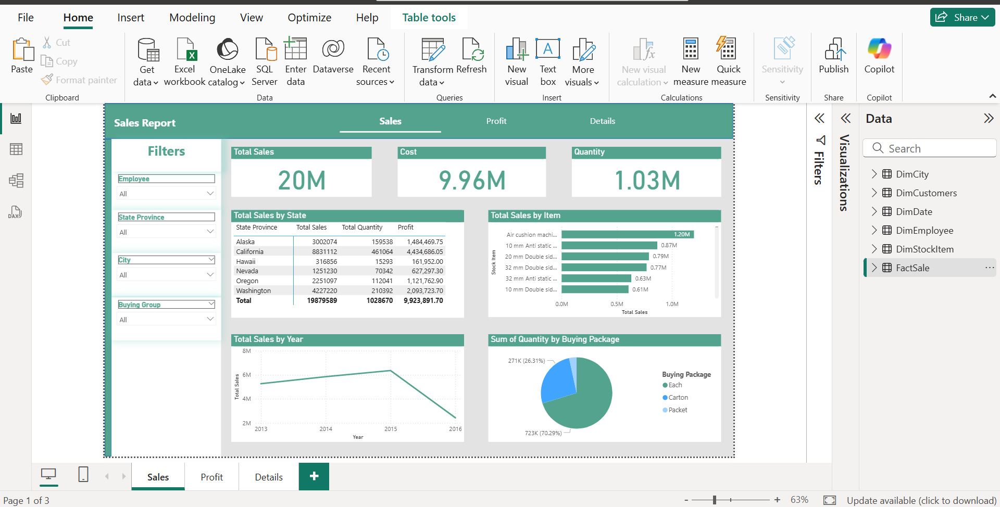
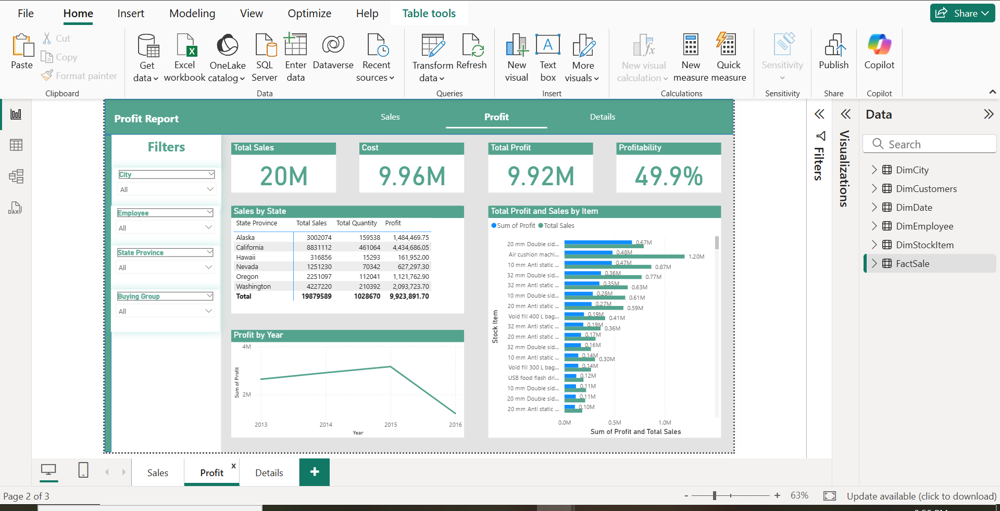
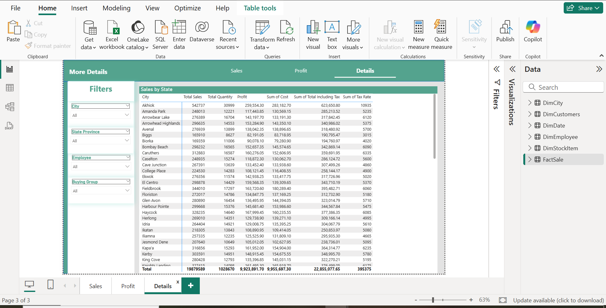

# 📊 Power BI Dashboard - Wide World Importers (WWI)

## 📂 Project Overview
This project presents an interactive **Power BI Dashboard** built using the **Wide World Importers (WWI)** dataset.  
The dashboard provides insights into sales performance, profitability, and additional business details.

## 📑 Dashboard Pages
1. **Sales Report**  
   - Overview of total sales  
   - Trends and patterns across products, regions, and time  

2. **Profit Report**  
   - Profit analysis across categories  
   - Comparison between revenue and costs  

3. **More Details**  
   - Additional insights and breakdowns    

## 📸 Dashboard Preview

### Sales Report

### Profit Report

### More Details

## 🛠 Tools & Technologies
- Power BI Desktop  
- Wide World Importers (WWI) dataset  

